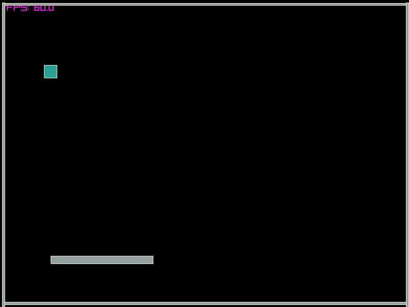

# LoveRay

A [Love2D](https://love2d.org) 11.5 compatible runtime built on [raylib](https://www.raylib.com), Lua 5.4 and Box2D.

Write a game with the Love2D API, run it with `love <game directory>` on Linux, Windows or in the browser.



## Status

LoveRay implements the core of the Love2D API: `love.run` and the callback loop, `conf.lua`, `love.filesystem` with a save directory, `love.graphics` (shapes, text, images, quads, canvases, sprite batches, shaders, particle systems, meshes, stencils, blend modes, scissor, transforms), `love.keyboard`, `love.mouse`, `love.joystick`, `love.audio`, `love.math`, `love.image`, `love.window`, `love.timer`, `love.event` and `love.physics` with every Box2D joint type.

Shaders are supported through `love.graphics.newShader` with Love's GLSL dialect (`effect` and `position`), including uniforms, extra textures and post-processing through canvases.

Particle systems implement the full `ParticleSystem` API.

Not implemented yet: video, threads, `love.data`, `love.sound`, `love.font` and `love.touch`. See [docs/API.md](docs/API.md) for the function-level status and [docs/ROADMAP.md](docs/ROADMAP.md) for what comes next.

## Quick start

```sh
git clone https://github.com/akadjoker/LoveRay
cd LoveRay
cmake -S . -B build -G Ninja -DCMAKE_BUILD_TYPE=Release
cmake --build build
./bin/love examples/hello
```

Linux needs the OpenGL and X11 development packages, for example on Debian or Ubuntu:

```sh
sudo apt-get install cmake ninja-build libgl1-mesa-dev libx11-dev libxrandr-dev \
  libxcursor-dev libxinerama-dev libxi-dev libxkbcommon-dev
```

On Windows use MSYS2 (`mingw-w64-x86_64-gcc`, `cmake`, `ninja`). All third-party libraries are vendored, nothing else is required.

Prebuilt Linux, Windows and web packages are attached to every [release](https://github.com/akadjoker/LoveRay/releases).

## Running games

```sh
love path/to/game            # a directory containing main.lua
love path/to/game/main.lua   # also accepted
love game.love               # a zip archive with main.lua at its root
love                         # shows the "no game" screen
love --version
love path/to/game --frames 300 --screenshot shot.png   # headless testing
```

A game is a folder with `main.lua` and an optional `conf.lua`:

```lua
function love.conf(t)
    t.window.title = "My game"
    t.window.width = 800
    t.window.height = 600
end
```

```lua
local player = { x = 100, y = 100 }

function love.update(dt)
    if love.keyboard.isDown("right") then player.x = player.x + 200 * dt end
end

function love.draw()
    love.graphics.rectangle("fill", player.x, player.y, 32, 32)
end
```

### Shipping a game

Zip the contents of your game folder (`main.lua` at the top level) and rename it to `game.love`. To ship a single executable, append the archive to the runtime:

```sh
cat love game.love > mygame && chmod +x mygame      # Linux
copy /b love.exe+game.love mygame.exe               # Windows
```

A fused executable runs its own game and passes every command line argument to it. `love.filesystem.mount` can add further zip files or folders at runtime.

Errors show the usual blue screen with a traceback. Press `R` to restart or `Escape` to quit. Setting `t.loveray.hotreload = true` in `conf.lua` restarts the game whenever `main.lua` or `conf.lua` changes.

## Examples

| Example | Shows |
| --- | --- |
| `examples/hello` | shapes, text wrapping and alignment, colored text, transforms |
| `examples/sprites` | images, quads, sprite batches, keyboard and mouse |
| `examples/input` | every input callback |
| `examples/canvas` | offscreen rendering, blend modes, scissor |
| `examples/physics` | bodies, joints, contacts, mouse dragging, a wheeled car |
| `examples/particles` | fire, smoke, fountain, bursts and snow, `love examples/particles snow` picks one |
| `examples/mesh` | a textured grid that waves and a vertex-colored radar fan |
| `examples/stencil` | spotlight, cut-out windows and inverse masks, `love examples/stencil windows` picks one |
| `examples/shader` | post-processing effects (grayscale, wave, vignette, pixelate, chromatic), `love examples/shader wave` picks one |
| `examples/pong` | two player pong, W/S and Up/Down, first to seven |
| `examples/snake` | grid snake with growing speed and a best score |
| `examples/asteroids` | vector asteroids with waves, splitting rocks, wrap-around and hyperspace |
| `examples/shmup` | side scrolling shoot'em up with enemy waves and parallax stars |
| `examples/platformer` | scrolling platformer with a smooth camera, coins, spikes and a goal |
| `examples/candy` | match-three puzzle played with the mouse |
| `examples/timer` | dt based timers, state switching, a countdown and `love.timer` readouts |
| `examples/tutorials` | twelve interactive lessons, `love examples/tutorials 8` opens a lesson directly |

## Web build

Every push to `main` publishes the examples at https://akadjoker.github.io/LoveRay/ through GitHub Pages. Pick one from the links under the canvas or with `?game=<name>`.

With the Emscripten SDK active:

```sh
emcmake cmake -S . -B build-web -G Ninja -DCMAKE_BUILD_TYPE=Release
cmake --build build-web
```

This produces `bin/love.html`, `love.js`, `love.wasm` and `love.data`. Serve them over HTTP and pick a game with `?game=<name>`. The `examples` folder is preloaded by default, use `-DLOVERAY_WEB_GAME=<dir>` to bundle your own games.

## Differences from Love2D

- Fonts are rasterized from TrueType files at load time. The built-in font is DejaVu Sans.
- Shaders target GLSL 3.30 on desktop and GLSL ES 1.00 in the browser. There is no depth buffer, the matching functions are no-ops.
- `love.physics` uses Box2D 2.4, so joint stiffness is expressed through frequency and damping ratio helpers that map onto it.
- `love.filesystem` reads from the game folder, `.love` and zip archives and the save directory. ZIP64 and encrypted archives are not supported.
- `Source:queue`, audio effects and custom image cursors are not available.

LoveRay-only additions: `love.loveray` (version information), `World:draw()` for Box2D debug rendering, the `--frames` and `--screenshot` options and the `loveray` section in `conf.lua`.

## Tests

```sh
tests/smoke.sh
```

Runs the API and physics conformance games plus every example headless under Xvfb, and fails on the first error.

## Credits

The original LoveRay was a quick experiment mixing raylib and Lua with its own bindings. The previous implementation is kept under `legacy/` for reference.

Built on raylib, Lua, Box2D and the DejaVu Sans font.
